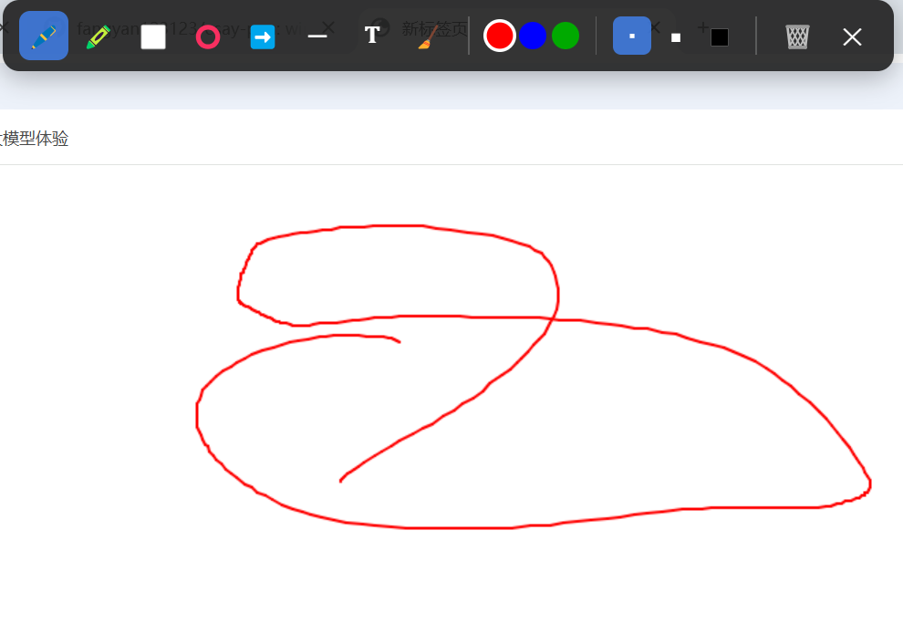

<div align="center">

# 🖊️ easy-pen

**专为教师授课设计的轻量级屏幕标注工具**

在任何应用（PPT、网页、PDF、视频）之上自由涂鸦、画图形、写文字，讲完即擦，对原内容零干扰。


</div>

---

## ✨ 核心特性

| 特性 | 说明 |
| --- | --- |
| 🖥️ **全屏透明覆盖** | 置顶透明画板盖在所有窗口之上，标注时底层 PPT / 网页 / PDF 内容完全不受影响 |
| 🎨 **8 种标注工具** | 画笔、荧光笔、矩形、圆形、直线、箭头、文字、橡皮擦 |
| ⌨️ **一键呼出** | 全局快捷键 `Ctrl+Q` 随时显示 / 隐藏画板，不打断讲课节奏 |
| ↩️ **撤销 / 重做** | 以「矢量对象」方式记录每一笔，可逐步撤销与重做 |
| 🧽 **智能橡皮擦** | 按对象整体擦除——点中哪个图形就删哪个，不会误伤其它标注 |
| 👆 **触摸屏支持** | 鼠标与触控均可绘制，适配触摸一体机 / 白板 |
| 🧰 **常驻托盘** | 后台静默运行，托盘图标双击即可切换，右键菜单快捷操作 |
| 🔒 **安全架构** | Electron `contextIsolation` 上下文隔离，禁用 `nodeIntegration` |

---

## 📸 效果展示



> 运行后按 `Ctrl+Q` 呼出画板，即可在任意内容（PPT / 网页 / 文档）之上自由标注。

**界面一览**：顶部居中的深色毛玻璃工具栏，从左到右依次是——绘图工具、颜色、粗细、清除 / 关闭。可拖动到屏幕任意位置。

---

## 🎨 功能一览

### 绘图工具

| 工具 | 图标 | 说明 |
| --- | :---: | --- |
| 画笔 | 🖊️ | 自由手绘，平滑连续线条 |
| 荧光笔 | 🖍️ | 半透明粗线（透明度 30%、线宽 ×4），适合标注重点、不遮挡底图 |
| 矩形 | ⬜ | 拖拽绘制矩形框 |
| 圆形 | ⭕ | 拖拽绘制椭圆 |
| 直线 | ─ | 拖拽绘制直线 |
| 箭头 | ➡️ | 拖拽绘制带箭头的指示线（箭头自动生成） |
| 文字 | 𝐓 | 点击定位，弹出输入框输入文字，`Enter` 确认绘制 |
| 橡皮擦 | 🧹 | 点击已有图形即可整体擦除（按对象删除） |

### 颜色与粗细

- **颜色**：🔴 红 · 🔵 蓝 · 🟢 绿
- **粗细**：细（2）· 中（5）· 粗（10）— 同时影响线条宽度和文字字号

---

## ⌨️ 快捷键

| 快捷键 | 功能 | 作用范围 |
| :---: | --- | --- |
| `Ctrl + Q` | 显示 / 隐藏画板 | 全局，随时可用 |
| `Esc` | 退出画笔模式 | 画板开启时 |
| `Ctrl + Z` | 撤销上一步 | 画板开启时 |
| `Ctrl + Shift + Z` | 重做 | 画板开启时 |
| `Delete` | 清除全部内容（会二次确认） | 画板开启时 |

---

## 🚀 快速开始

### 环境要求

- **Node.js** ≥ 18
- **Windows** 10 / 11

### 安装与运行

```bash
# 1. 安装依赖（首次会下载 Electron，如较慢可配置国内镜像）
npm install

# 2. 启动应用
npm start
```

启动后任务栏不会出现窗口，而是在**系统托盘**显示一个蓝色画笔图标——应用已就绪。

> 💡 如果 `npm install` 下载 Electron 很慢，可先设置镜像：
> ```bash
> set ELECTRON_MIRROR=https://npmmirror.com/mirrors/electron/
> npm install
> ```

### 打包成 exe

```bash
npm run build
```

打包产物输出到 `dist/win-unpacked/`，其中 `easy-pen.exe` 可脱离 Node.js 独立运行，直接分发给其他老师使用。

---

## 📖 使用方法

**典型授课流程：**

1. **启动** `npm start`（或运行打包后的 `easy-pen.exe`），托盘出现画笔图标。
2. **打开你的课件**（PPT、网页、PDF、视频均可）。
3. **按 `Ctrl + Q`** 呼出全屏透明画板——此时整个屏幕变成可标注的画布。
4. 在顶部工具栏选择 **工具 / 颜色 / 粗细**，开始标注。
5. 画错了？`Ctrl + Z` 撤销，或用**橡皮擦**点掉单个图形，或 `Delete` 清空重来。
6. **再按 `Ctrl + Q`**（或 `Esc`）隐藏画板，无缝回到课件继续讲解。
7. 退出程序：右键托盘图标 → **退出**。

**小技巧：**
- 工具栏挡住了内容？按住工具栏空白处可以**拖动**它到任意位置。
- 每次呼出画板都会**自动清空**，保证每次都是干净的新面板。
- 标注时底层应用内容**完全不变**，因为画板是独立的透明覆盖层。

---

## 🏗️ 技术架构

### 工作原理

```
┌─────────────────────────────────────┐
│  PPT / 浏览器 / PDF（底层内容）        │  ← 完全不受影响
├─────────────────────────────────────┤
│  透明全屏置顶窗口（Electron 画板）      │  ← transparent + alwaysOnTop
│  ┌───────────────────────────┐       │
│  │  HTML5 Canvas（绘图层）     │       │
│  └───────────────────────────┘       │
│  ┌───────────────────────────┐       │
│  │  毛玻璃工具栏（可拖动）      │       │
│  └───────────────────────────┘       │
└─────────────────────────────────────┘
```

- **透明覆盖层**：主窗口设为透明、无边框、置顶、全屏，作为覆盖在所有应用之上的画布。
- **矢量对象存储**：每一笔都以结构化对象（点序列 / 起止坐标 / 文本）存入撤销栈，而非位图——这让**对象级橡皮擦**和**无损撤销 / 重做**成为可能。
- **主-渲染隔离**：主进程负责窗口 / 托盘 / 全局快捷键，渲染进程只做 Canvas 绘制，通过 `contextBridge` 安全通信。

### 安全实践

| 配置 | 状态 |
| --- | --- |
| `contextIsolation` | ✅ 开启 |
| `nodeIntegration` | ❌ 禁用 |
| IPC 通信 | ✅ 经 `contextBridge` 最小化暴露 |

---

## ✅ 测试与验证

> 本项目作为轻量桌面工具，当前以**手动功能验证**为主，尚未引入自动化测试框架。以下是完整的功能验证清单，可用于自测或回归。

### 1. 环境与启动

- [ ] `node -v` 能正确输出版本号
- [ ] `npm install` 安装成功，无报错
- [ ] `npm start` 后托盘出现蓝色画笔图标，无错误弹窗

### 2. 画板开关

- [ ] 任意界面按 `Ctrl+Q` → 全屏画板出现，顶部显示工具栏
- [ ] 再按 `Ctrl+Q` 或 `Esc` → 画板隐藏，回到原应用
- [ ] **双击托盘图标** → 切换画板显示 / 隐藏
- [ ] **右键托盘** → 「显示/隐藏画笔」「退出」菜单均可用

### 3. 绘图工具（逐项）

- [ ] **画笔**：拖动绘制连续平滑线条
- [ ] **荧光笔**：线条明显更粗且**半透明**，可透出底图
- [ ] **矩形**：拖拽生成矩形框，松手定格
- [ ] **圆形**：拖拽生成椭圆
- [ ] **直线**：拖拽生成直线
- [ ] **箭头**：拖拽生成带**箭头头**的指示线
- [ ] **文字**：点击出现输入框 → 输入文字 → 按 `Enter` 绘制到画布；按 `Esc` 取消
- [ ] **橡皮擦**：点击任一已有图形，该图形**整体消失**（不影响其它图形）

### 4. 颜色与粗细

- [ ] 切换 红 / 蓝 / 绿，新绘制使用对应颜色
- [ ] 切换 细 / 中 / 粗，线条宽度随之变化；文字工具的字号也同步变化

### 5. 撤销 / 重做 / 清除

- [ ] 绘制数笔后 `Ctrl+Z` → 逐步撤销
- [ ] `Ctrl+Shift+Z` → 逐步重做
- [ ] `Delete`（或工具栏 🗑️）→ 弹出确认框 → 确认后清空全部

### 6. 工具栏交互

- [ ] 按住工具栏空白处可**拖动**工具栏到屏幕任意位置
- [ ] 当前选中的工具 / 颜色 / 粗细高亮显示（蓝色）

### 7. 跨应用覆盖（核心能力）

- [ ] 打开 PPT / 浏览器 / PDF，按 `Ctrl+Q` 能在其**上方**涂鸦
- [ ] 涂鸦过程中底层应用内容**不被破坏**
- [ ] 隐藏画板后，底层应用**完全恢复原状**

### 8. 打包验证

- [ ] `npm run build` 成功完成
- [ ] `dist/win-unpacked/easy-pen.exe` 生成
- [ ] 双击该 exe 可在**未安装 Node.js** 的电脑上独立运行

> 🧪 **后续可引入的自动化测试方向**：渲染层工具逻辑（`renderer/tools/*`）是纯函数式模块，适合用 Jest + jsdom 做单元测试；主进程 IPC 可用 `@electron/test` 做集成测试。

---

## 📁 项目结构

```
easy-pen/
├── main.js                # 主进程：透明窗口、系统托盘、全局快捷键、IPC
├── preload.js             # 预加载脚本：经 contextBridge 安全暴露 API
├── package.json           # 项目配置与 electron-builder 打包设置
├── assets/
│   └── icon.png           # 应用 / 托盘图标
└── renderer/              # 渲染进程（界面层）
    ├── index.html         # 工具栏布局
    ├── style.css          # 样式（毛玻璃工具栏、按钮态）
    ├── canvas.js          # 绘图引擎：撤销 / 重做栈、事件分发
    ├── toolbar.js         # 工具栏交互、快捷键绑定
    └── tools/             # 各绘图工具（统一接口：onPointerDown/Move/Up + render）
        ├── pen.js         # 画笔
        ├── highlighter.js # 荧光笔
        ├── shapes.js      # 矩形 / 圆形 / 直线 / 箭头
        ├── text.js        # 文字
        └── eraser.js      # 橡皮擦（对象级命中检测）
```

---

## 🗺️ 开发计划

- [ ] 截图 / 保存画板内容为图片
- [ ] 自定义颜色拾取器
- [ ] 更多快捷键（如数字键切换工具）
- [ ] 引入单元测试

---

## 📄 许可证

[MIT License](LICENSE) © easy-pen

> 本项目面向教育场景开源，欢迎老师们自由使用、修改与分享。
